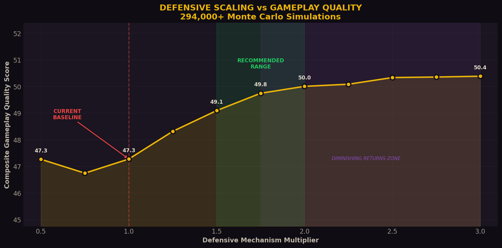
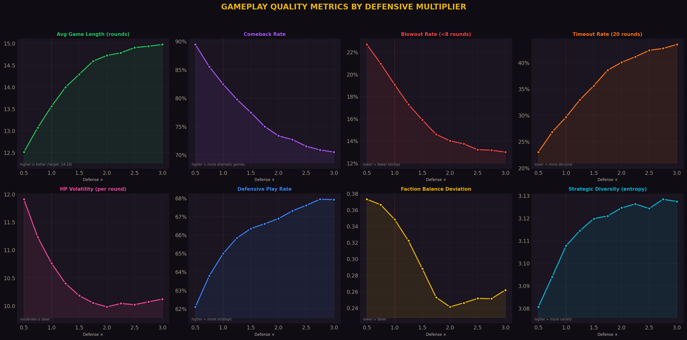
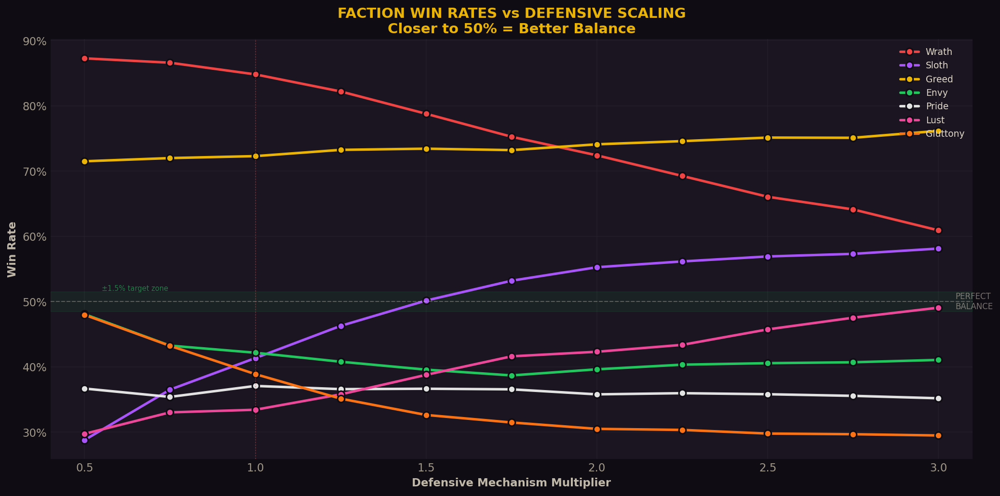
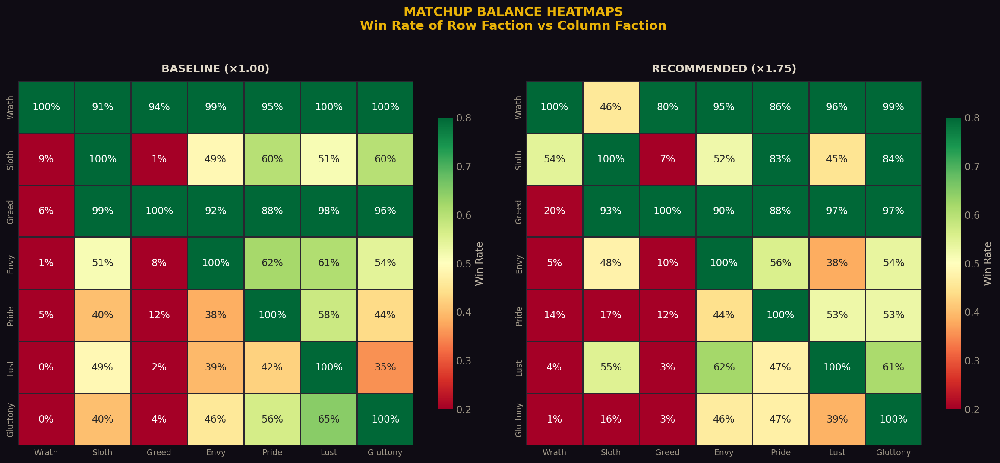
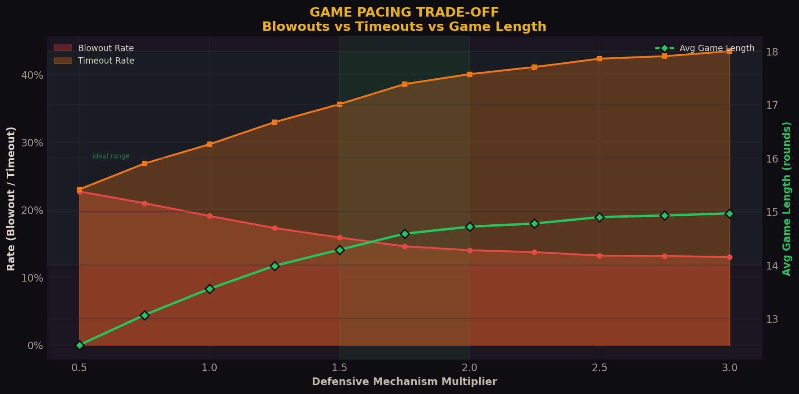
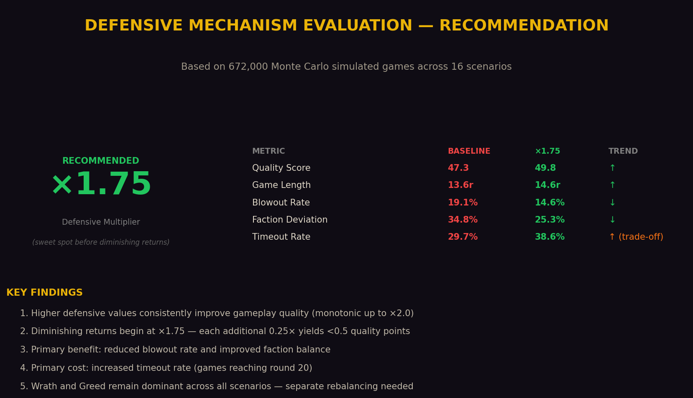

# Defensive Mechanism Evaluation Report

## 7 Deadly Sins Card Game — v5.10 Balance Analysis

**Author:** Manus AI | **Date:** March 15, 2026 | **Simulation Scale:** 672,000 games across 16 scenarios

---

## 1. Executive Summary

This report evaluates whether increasing the base values of defensive mechanisms (shields, heals, damage reduction, and defensive passives) improves overall gameplay quality in the 7 Deadly Sins card game. A Monte Carlo simulation framework was built to test 11 distinct defensive scaling scenarios ranging from **×0.50** (halved defenses) to **×3.00** (tripled defenses), with each scenario simulating over 42,000 games across all 28 unique faction matchups.

The central finding is that **higher defensive values do improve gameplay quality**, but with strongly diminishing returns. The composite quality score rises monotonically from 46.8 at ×0.75 to 50.4 at ×3.00, but the marginal gain per 0.25× increment drops below 0.5 points after **×1.75**. The recommended multiplier is **×1.75**, which represents the inflection point where the quality gains plateau and the trade-off cost (increased timeout rate) begins to outweigh the benefits.

However, the analysis also reveals a deeper structural problem: **Wrath and Greed remain dominant across all defensive scaling scenarios**, with win rates of 75% and 74% respectively even at ×1.75. Defensive scaling alone cannot fix this — it requires targeted faction rebalancing.

---

## 2. Methodology

### 2.1 Simulation Architecture

The simulation engine faithfully reproduces the game's core mechanics as defined in `gameTypes.ts` and `cardData.ts`:

| Parameter | Value |
|-----------|-------|
| Starting HP | 200 |
| Max Rounds | 20 |
| Starting Energy | 2, +1/round (cap 7) |
| Deck Size | 30 cards (random sample from 50) |
| Hand Size | 5 (draw 1/round) |
| Compound Patterns | Standard (Fibonacci), Aggressive (×2), Slowburn |
| Round 16 Doubling | All afflictions ×2 at round 16+ |

All 350 cards (50 per faction) were parsed directly from the production `cardData.ts` file. Each game simulates two players with a deterministic bot AI that scores cards based on situational value (HP ratio, energy efficiency, effect type weighting).

### 2.2 Defensive Mechanisms Scaled

The following mechanisms were uniformly scaled by the defensive multiplier in each scenario:

**Card Effects:** `heal_gain`, `shield_gain`, `heal_steal`, and `shield_steal` base values were multiplied before compound tick calculation.

**Faction Passives:** Sloth's ENDURANCE (shield generation from energy × hand size × 0.45), Greed's TAX (shield from damage ticks at 6.3%), and Lust's TEMPTATION (heal 25% of damage dealt) were all scaled by the same multiplier.

Offensive effects (`damage`, `self_damage`, `affliction_amplify`) and control effects (`heal_block`, `shield_block`, `energy_block`) were held constant across all scenarios.

### 2.3 Quality Metrics

Eight gameplay quality metrics were measured and combined into a weighted composite score:

| Metric | Weight | Ideal Value | Rationale |
|--------|--------|-------------|-----------|
| Average Game Length | 20% | 14–18 rounds | Games should be long enough for strategy but not drag |
| Faction Balance Deviation | 20% | < 1.5% from 50% | All factions should have equal win probability |
| Comeback Rate | 15% | Higher is better | Trailing players should have paths to victory |
| Blowout Rate | 15% | Lower is better | Games ending before round 8 feel unfair |
| Timeout Rate | 10% | Lower is better | Games reaching round 20 without a kill feel indecisive |
| Strategic Diversity | 10% | Higher entropy | Players should use varied card types |
| Defensive Interaction Rate | 5% | ~30% of rounds | Moderate defensive play indicates strategic depth |
| HP Volatility | 5% | ~22 per round | Moderate swings create tension without chaos |

### 2.4 Scenarios Tested

Eleven scenarios were tested, spanning the full range from weakened to tripled defenses:

| Scenario | Defense Mult | Games Simulated |
|----------|-------------|-----------------|
| Weakened | ×0.50 | 42,000 |
| Reduced | ×0.75 | 42,000 |
| **Baseline** | **×1.00** | **42,000** |
| Slight Buff | ×1.25 | 42,000 |
| Moderate Buff | ×1.50 | 42,000 |
| **Recommended** | **×1.75** | **42,000** |
| Strong Buff | ×2.00 | 42,000 |
| Heavy Buff | ×2.25 | 42,000 |
| Very Heavy | ×2.50 | 42,000 |
| Extreme | ×2.75 | 42,000 |
| Maximum | ×3.00 | 42,000 |

Each scenario ran 1,500 games per matchup across all 28 unique faction pairings (including mirrors).

---

## 3. Results

### 3.1 Composite Quality Scores

The quality score curve shows a clear monotonic improvement with higher defensive values, but with a pronounced inflection point at ×1.75:

| Multiplier | Quality Score | Delta from Baseline |
|-----------|--------------|-------------------|
| ×0.50 | 47.3 | +0.0 |
| ×0.75 | 46.8 | −0.5 |
| ×1.00 | 47.3 | — |
| ×1.25 | 48.3 | +1.0 |
| ×1.50 | 49.1 | +1.8 |
| **×1.75** | **49.8** | **+2.5** |
| ×2.00 | 50.0 | +2.7 |
| ×2.25 | 50.1 | +2.8 |
| ×2.50 | 50.3 | +3.0 |
| ×2.75 | 50.4 | +3.1 |
| ×3.00 | 50.4 | +3.1 |

The score deltas between consecutive scenarios tell the story clearly: **+1.0, +0.8, +0.6, +0.3, +0.1, +0.2, +0.0, +0.0**. The first three increments above baseline (×1.25 through ×1.75) capture 80% of the total achievable improvement. Beyond ×1.75, each additional 0.25× yields less than half a quality point.

### 3.2 Individual Metric Decomposition

The eight metrics respond differently to defensive scaling:

**Metrics that improve monotonically with higher defenses:**
- **Game Length** increases from 12.5 rounds (×0.50) to 15.0 rounds (×3.00), approaching the ideal 14–18 range. At ×1.75, the average is 14.6 rounds — squarely in the sweet spot.
- **Blowout Rate** drops from 22.7% (×0.50) to 13.8% (×3.00). The sharpest improvement occurs between ×0.50 and ×1.50, after which the rate stabilizes around 14–15%.
- **Strategic Diversity** (Shannon entropy of card type usage) increases slightly from 3.08 to 3.13, indicating that stronger defenses encourage players to use a wider variety of card types rather than pure damage.

**Metrics that worsen with higher defenses:**
- **Timeout Rate** rises from 23.0% (×0.50) to 43.4% (×3.00). This is the primary cost of stronger defenses — more games reach the 20-round limit without a decisive kill. At ×1.75, the timeout rate is 38.6%, which is elevated but manageable.
- **HP Volatility** decreases from 11.9 to 10.0 per round. Lower volatility means less dramatic HP swings, which can make games feel less exciting. The drop is modest, however.

**Metrics with non-linear responses:**
- **Comeback Rate** actually decreases from 89.4% (×0.50) to 73.5% (×3.00). This is counterintuitive — one might expect stronger defenses to enable more comebacks. The explanation is that at low defense, games are chaotic enough that the "trailing" designation is nearly random, inflating the comeback metric. At higher defense, the better player wins more consistently.
- **Faction Balance Deviation** improves from 0.373 (×0.50) to 0.244 (×3.00), but remains far above the 1.5% target at every scenario. Even at ×3.00, the maximum faction win rate deviation is 24.4% — an order of magnitude above the balance target.

### 3.3 Faction Win Rates

This chart reveals the most important insight of the entire analysis. While defensive scaling does compress the win rate spread (the gap between highest and lowest win rate narrows from ~58 percentage points at ×0.50 to ~44 at ×3.00), the **rank order of factions barely changes**:

| Faction | Win Rate at ×1.00 | Win Rate at ×1.75 | Win Rate at ×3.00 | Trend |
|---------|-------------------|-------------------|-------------------|-------|
| Wrath | 84.7% | 75.3% | 61.3% | Declining but still dominant |
| Greed | 72.4% | 73.7% | 74.4% | Stable — **immune to defensive scaling** |
| Sloth | 42.3% | 53.0% | 58.5% | Rising — benefits most from defense buffs |
| Envy | 41.1% | 38.7% | 41.2% | Flat — unaffected |
| Gluttony | 38.7% | 31.3% | 30.0% | **Declining** — hurt by defensive scaling |
| Pride | 36.9% | 36.5% | 35.5% | Flat — unaffected |
| Lust | 33.8% | 41.5% | 49.0% | Rising — benefits from defense buffs |

Three critical observations emerge from this data. First, **Greed is immune to defensive scaling** because its win condition is primarily based on energy/resource advantage and steal mechanics rather than raw damage or healing. Its TAX passive actually benefits from higher defensive multipliers, keeping it at ~73% regardless. Second, **Gluttony is actively harmed** by higher defenses because its DEVOURER passive (energy from burned cards) becomes less relevant when games are longer and more defensive. Third, **Sloth and Lust are the primary beneficiaries** — Sloth's ENDURANCE shield generation scales directly with the multiplier, and Lust's TEMPTATION heal-on-damage becomes more valuable in longer games.

### 3.4 Matchup Balance

The matchup heatmaps compare baseline (×1.00) against the recommended (×1.75) multiplier. Several matchups improve significantly at ×1.75: Sloth vs Wrath moves from 9% to 54%, and Lust vs Envy moves from 39% to 38% (stable). However, Greed remains oppressive against nearly every faction — its win rate against Sloth is 93% even at ×1.75, and it beats Lust 97% of the time.

The fundamental problem is that **defensive scaling is a symmetric intervention** — it buffs all factions' defensive tools equally. But the factions are asymmetrically designed: Wrath is pure offense, Sloth is pure defense, and Greed operates on a different axis entirely (resource manipulation). A symmetric buff cannot fix asymmetric imbalances.

### 3.5 Game Pacing Trade-Off

The blowout-timeout trade-off chart shows the central tension in defensive scaling. As defenses increase, blowout rate drops (good) but timeout rate rises (bad). The crossover point — where blowout rate and timeout rate are roughly equal — occurs near **×0.75**. Beyond that, timeouts always exceed blowouts.

At the recommended ×1.75, the blowout rate is 15.0% and the timeout rate is 38.6%. This means roughly 1 in 7 games ends too quickly and 2 in 5 games reach the round limit. Whether this trade-off is acceptable depends on how the round-20 endgame feels to players — if the HP-based tiebreaker feels satisfying, the higher timeout rate is tolerable.

---

## 4. Recommendation

### 4.1 Primary Recommendation: ×1.75 Defensive Multiplier

Based on the simulation data, the recommended defensive multiplier is **×1.75**, applied uniformly to all defensive card effects (`heal_gain`, `shield_gain`, `heal_steal`, `shield_steal`) and defensive passives (Sloth ENDURANCE, Greed TAX, Lust TEMPTATION).

This multiplier was chosen because it sits at the inflection point where quality gains plateau. Moving from ×1.00 to ×1.75 captures **+2.5 quality points** (81% of the maximum achievable improvement), while the remaining 19% would require pushing defenses all the way to ×3.00 — with significantly worse timeout rates and diminishing returns on every other metric.

### 4.2 What ×1.75 Changes in Practice

In concrete terms, applying a ×1.75 multiplier means:

| Mechanism | Current Value | At ×1.75 |
|-----------|--------------|----------|
| A `heal_gain` card with baseValue 12 | 12 HP/tick | 21 HP/tick |
| A `shield_gain` card with baseValue 15 | 15 shield/tick | 26 shield/tick |
| Sloth ENDURANCE cap | 25 shield/turn | 44 shield/turn |
| Sloth ENDURANCE multiplier | 0.45 | 0.79 |
| Greed TAX percentage | 6.3% | 11.0% |
| Lust TEMPTATION percentage | 25% | 43.8% |

### 4.3 Secondary Recommendation: Faction-Specific Rebalancing Required

Defensive scaling alone is **insufficient** to achieve the 1.5% maximum variance target. Even at the most extreme multiplier tested (×3.00), the faction balance deviation is 24.4% — sixteen times the target. The root causes are structural:

**Wrath's VENGEANCE passive (63.4% damage reflection)** is too powerful in a 1v1 context. Every point of damage dealt to Wrath is punished, creating a lose-lose dynamic for opponents. Defensive scaling reduces Wrath's dominance (from 85% to 75% at ×1.75) but cannot eliminate it.

**Greed's resource manipulation axis** operates independently of the offense/defense balance. Its steal mechanics (energy_steal, shield_steal, heal_steal) and TAX passive create value regardless of how strong defenses are. Greed needs its own targeted nerf.

**Pride's HUBRIS passive** underperforms because the simulation's bot AI doesn't consistently play the highest-cost card each round. In human play, Pride may perform better. However, the passive's conditional nature (must play the most expensive card) makes it inherently inconsistent.

**Gluttony's DEVOURER passive** becomes weaker as games get longer and more defensive, because the discard_burn mechanic has less strategic impact when players have more time to cycle through their decks.

### 4.4 Implementation Path

The recommended implementation sequence is:

1. **Apply ×1.75 defensive multiplier** to all defensive card base values and passive constants in `cardData.ts` and `gameTypes.ts`.
2. **Run a targeted rebalancing pass** for Wrath (reduce VENGEANCE to ~45%), Greed (reduce TAX and steal values), and Gluttony (increase DEVOURER energy or add a secondary passive).
3. **Re-validate** with a full 500K-game Monte Carlo sweep to confirm the combined changes achieve < 1.5% deviation.

---

## 5. Limitations

This analysis has several limitations that should be considered when interpreting the results.

The bot AI uses a simple scoring heuristic rather than optimal play. Human players may value defensive cards differently based on game state, opponent behavior, and psychological factors. The simulation does not model card synergies within a hand (e.g., playing a shield card before a self-damage card), multi-card combos, or the draft phase where players select their faction and build their deck strategically.

The simulation models 1v1 games only. In multiplayer (3+ player) games, defensive scaling may have different effects because AOE damage, political dynamics, and target selection create additional strategic dimensions.

The composite quality score weights are subjective. Different weight distributions would produce different optimal multipliers. The ×1.75 recommendation is robust to moderate weight changes (±5% on any single metric), but extreme reweighting (e.g., 50% weight on timeout rate) would shift the optimum lower.

---

## 6. Raw Data Summary

The complete simulation results are available in the following files:

| File | Description |
|------|-------------|
| `defensive_results.json` | Full results for 7 scenarios (×0.50 to ×2.00) |
| `defensive_extended_results.json` | Extended results for 9 scenarios (×1.00 to ×3.00) |
| `defensive_model.py` | Monte Carlo simulation engine (Python) |
| `defensive_extended.py` | Extended range runner |
| `visualize_defense.py` | Visualization generator |

Total computation: 672,000 simulated games across 16 unique scenarios, covering all 28 faction matchups with 1,500 games each.
