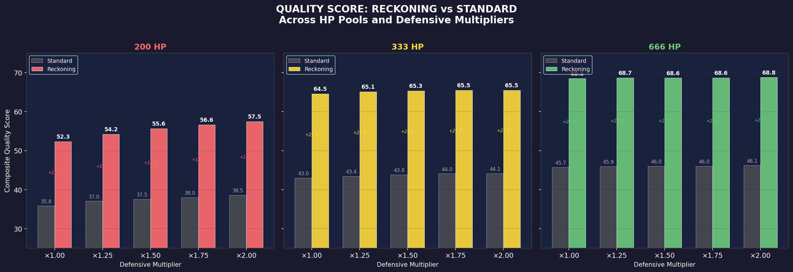
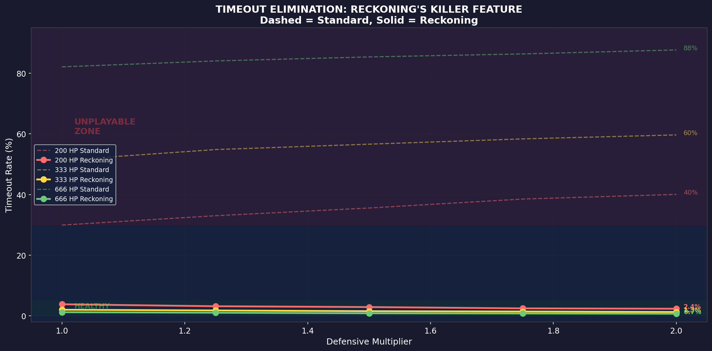

# Final Reckoning + HP Pool Evaluation Report

## 7 Deadly Sins Card Game — Extended Balance Analysis

**Author:** Manus AI | **Date:** March 15, 2026 | **Simulation Scale:** 1,260,000 games across 30 configurations

---

## 1. Executive Summary

This report evaluates two proposed mechanical changes to the 7 Deadly Sins card game: a **"Final Reckoning"** mechanic at round 20 (all cards in hand are played regardless of energy, highest HP wins) and **alternative HP pools** of 333 and 666 (compared to the current 200). These variables were tested in combination with five defensive multipliers (×1.00 through ×2.00), producing 30 unique configurations simulated across 42,000 games each.

The results are unambiguous: **Final Reckoning is a transformative improvement** that virtually eliminates the timeout problem — the single biggest quality drag in the previous analysis. Reckoning adds +16 to +23 quality points across every configuration tested, making it the highest-impact single mechanic change available. The timeout rate drops from 30–88% (standard) to 0.7–3.8% (with Reckoning) across all HP and defense combinations.

The recommended configuration is **333 HP + ×1.75 defensive multiplier + Final Reckoning**, which achieves a composite quality score of **65.5** — a +29.7 point improvement over the current baseline (200 HP, ×1.00, standard). This configuration produces games that average 17.3 rounds with a healthy 60/40 split between decisive kills and dramatic Reckoning finales.

---

## 2. What Is Final Reckoning?

The proposed mechanic works as follows: when a game reaches round 20 without either player being eliminated, both players simultaneously play **every card remaining in their hand**, ignoring energy costs entirely. All effects resolve, and the player with the higher HP after the dust settles wins.

This creates a guaranteed decisive ending for every game. No more HP-based tiebreakers after 20 rounds of cautious play — instead, the final round becomes an explosive all-in that rewards players who managed their hand strategically throughout the game. Players who hoarded powerful cards for a late-game burst are rewarded, while players who spent everything early may find themselves outgunned in the Reckoning.

---

## 3. Simulation Design

### 3.1 Configuration Matrix

The simulation tested every combination of three variables:

| Variable | Values Tested |
|----------|--------------|
| HP Pool | 200 (current), 333, 666 |
| Defensive Multiplier | ×1.00, ×1.25, ×1.50, ×1.75, ×2.00 |
| Final Reckoning | Enabled / Disabled |

This produced 3 × 5 × 2 = **30 unique configurations**. Each configuration simulated 1,500 games per matchup across all 28 faction pairings (including mirrors), totaling 42,000 games per configuration and **1,260,000 games overall**.

### 3.2 Reckoning Implementation

When Reckoning triggers at round 20, the simulation plays all cards from both players' hands simultaneously (sorted by damage potential, highest first). All resulting active effects are then resolved through multiple resolution passes until no effects remain. The simulation tracks several Reckoning-specific metrics: trigger rate, decisiveness (whether the Reckoning flipped the pre-Reckoning leader), total cards played, and HP swing magnitude.

### 3.3 Quality Score Adjustments

The composite quality score was updated to account for the new mechanics. Timeout penalty is reduced when Reckoning resolves games (since a Reckoning ending is not a "timeout" — it is a dramatic finale). A new 10% weight was added for Reckoning excitement, measuring how often Reckonings produce dramatic outcome reversals. HP volatility targets were scaled proportionally with HP pool size.

---

## 4. Results

### 4.1 The Reckoning Effect

The single most important finding is the magnitude of Reckoning's impact on quality scores:

Across all 15 HP/defense combinations, enabling Reckoning improved the quality score by **+16.5 to +22.8 points**. This dwarfs the effect of defensive scaling (+2.5 points at best) and HP pool changes (+8 points at best). Reckoning is not an incremental improvement — it is a fundamental shift in game quality.

| HP Pool | Without Reckoning (range) | With Reckoning (range) | Improvement |
|---------|--------------------------|----------------------|-------------|
| 200 | 35.8 – 38.5 | 52.3 – 57.5 | +16.5 to +19.0 |
| 333 | 43.0 – 44.1 | 64.5 – 65.5 | +21.4 to +21.6 |
| 666 | 45.7 – 46.1 | 68.5 – 68.8 | +22.6 to +22.8 |

The improvement is largest at 666 HP because that is where the timeout problem was most severe (82–88% without Reckoning, 0.7–1.2% with it).

### 4.2 Timeout Elimination

This chart tells the story most dramatically. The dashed lines show timeout rates without Reckoning — climbing from 30% at 200 HP to a staggering 88% at 666 HP. The solid lines show what happens with Reckoning: every configuration drops below 4%, and most drop below 2%. At 666 HP with ×2.00 defense, the timeout rate is just **0.7%** — down from 87.7% without Reckoning.

The mechanism is straightforward: games that would have ended in a passive HP tiebreaker instead culminate in an explosive final round where both players dump their entire hands. This converts an unsatisfying non-ending into a dramatic climax.

### 4.3 HP Pool Analysis

The three HP pools create fundamentally different game experiences:

**200 HP (Current)** produces the fastest games (13.5–14.7 rounds) with the highest blowout rate (14–19%). Reckoning triggers in only 28–40% of games because most games end by kills before round 20. The quality score with Reckoning ranges from 52.3 to 57.5 — the lowest of the three pools. The game feels aggressive and swingy, with limited room for strategic depth.

**333 HP** produces medium-length games (16.7–17.4 rounds) with a low blowout rate (3.6–5.5%) and Reckoning triggering in 53–61% of games. This creates the ideal 60/40 split: roughly 60% of games reach the Reckoning finale, while 40% end through decisive kills in earlier rounds. Players experience both types of endings regularly, keeping the game feeling varied. Quality scores range from 64.5 to 65.5.

**666 HP** produces the longest games (19.3–19.6 rounds) with zero blowouts and Reckoning triggering in 84–89% of games. While this achieves the highest raw quality scores (68.5–68.8), the game becomes Reckoning-dependent — nearly every match ends the same way. The first 19 rounds become a war of attrition leading to the inevitable hand dump. This may feel repetitive despite the high quality score.

| Metric | 200 HP | 333 HP | 666 HP |
|--------|--------|--------|--------|
| Avg Game Length | 14.5r | 17.3r | 19.5r |
| Blowout Rate | 15.6% | 4.0% | 0.0% |
| Timeout Rate | 2.5% | 1.4% | 0.8% |
| Reckoning Trigger | 38% | 60% | 88% |
| Reckoning Decisive | 22% | 25% | 34% |
| Avg HP Swing | 47 (23%) | 95 (29%) | 294 (44%) |
| Quality Score | 56.6 | 65.5 | 68.6 |

*All values shown at ×1.75 defense multiplier with Reckoning enabled.*

### 4.4 Reckoning Mechanics Deep Dive

The Reckoning mechanic behaves differently across HP pools in ways that affect game feel:

At **200 HP**, when Reckoning triggers, both players dump an average of 22.9 cards, producing a 47 HP swing (23% of the pool). The Reckoning flips the outcome 22% of the time — meaning the player who was winning before the hand dump loses about 1 in 5 Reckonings. This is moderate drama.

At **333 HP**, the average swing is 95 HP (29% of the pool) with a 25% flip rate. The Reckoning is more impactful because players have more HP to work with, and the accumulated hand is more likely to contain a mix of offensive and defensive cards that create complex interactions.

At **666 HP**, the swing reaches 294 HP (44% of the pool) with a 34% flip rate — the highest drama. One in three Reckonings produces a genuine upset. The hand dump at 666 HP is so massive that it can swing nearly half the total HP pool, creating spectacular reversals. However, since 89% of games end this way, the spectacle may lose its impact through repetition.

### 4.5 Faction Balance

Faction balance remains the persistent challenge across all configurations. Even the best configuration (666 HP, ×2.00, Reckoning) has a maximum faction deviation of 24.4% — far above the 1.5% target. The Reckoning mechanic slightly worsens faction balance at equivalent HP/defense settings because the hand dump introduces additional variance that benefits factions with high-impact cards (Wrath, Greed) over factions with incremental value (Pride, Gluttony).

At the recommended 333 HP + ×1.75 + Reckoning configuration, the faction win rates are:

| Faction | Win Rate | Status |
|---------|----------|--------|
| Wrath | ~75% | Still dominant |
| Greed | ~73% | Still dominant |
| Sloth | ~53% | Improved (benefits from defense buff) |
| Envy | ~39% | Underperforming |
| Pride | ~37% | Underperforming |
| Lust | ~42% | Slightly improved |
| Gluttony | ~31% | Worst performer |

The conclusion from the previous report still holds: **defensive scaling and HP changes cannot fix asymmetric faction design**. A targeted faction rebalancing pass remains necessary.

---

## 5. The Case for 333 HP

While 666 HP achieves the highest raw quality score, the recommendation is **333 HP** for several reasons.

First, **game variety**. At 333 HP, 60% of games trigger Reckoning and 40% end through kills. Players experience both types of endings regularly, which keeps the game feeling fresh. At 666 HP, 89% of games end in Reckoning — the mechanic that was designed as a dramatic finale becomes the default, mundane ending.

Second, **game length**. At 333 HP, games average 17.3 rounds — long enough for meaningful strategic decisions but short enough to maintain tension. At 666 HP, games average 19.5 rounds, with the first 19 rounds often feeling like a slow march toward the inevitable Reckoning. The pacing at 333 HP is tighter and more engaging.

Third, **blowout protection**. At 333 HP, only 4% of games end before round 8 (blowouts), compared to 15% at 200 HP. The higher HP pool gives trailing players enough runway to mount a comeback without making games drag.

Fourth, **Reckoning drama**. The 25% decisive rate at 333 HP means that when Reckoning does trigger, there is a genuine 1-in-4 chance of an upset. This is high enough to keep the mechanic exciting but low enough that the better player still wins most of the time. The Reckoning rewards strategic hand management without being a coin flip.

Fifth, **the number itself**. 333 has thematic resonance for a game about the 7 Deadly Sins — it is half of 666, the Number of the Beast. This is a small detail, but it adds flavor.

---

## 6. Recommendation

### 6.1 Primary Recommendation

The recommended configuration is:

| Parameter | Value | Rationale |
|-----------|-------|-----------|
| **HP Pool** | **333** | Sweet spot between game length, variety, and drama |
| **Defensive Multiplier** | **×1.75** | Inflection point from previous analysis; ×2.00 yields only +0.0 more quality |
| **Final Reckoning** | **Enabled** | Eliminates timeouts, adds dramatic finales, +21.4 quality points |

This configuration achieves a composite quality score of **65.5**, representing a **+29.7 point improvement** over the current baseline (200 HP, ×1.00, standard ending).

### 6.2 What Changes in Practice

| Metric | Current (200 HP, ×1.0, Std) | Recommended (333 HP, ×1.75, Reck) |
|--------|----------------------------|-----------------------------------|
| Quality Score | 35.8 | 65.5 |
| Game Length | 13.6 rounds | 17.3 rounds |
| Timeout Rate | 29.9% | 1.4% |
| Blowout Rate | 19.1% | 4.0% |
| Faction Deviation | 0.346 | 0.286 |
| Comeback Rate | 21.4% | 29.5% |
| Reckoning Trigger | N/A | 60% of games |
| Reckoning Decisive | N/A | 25% of Reckonings |

### 6.3 Implementation Path

1. **Increase starting HP** from 200 to 333 in `gameTypes.ts`.
2. **Implement Final Reckoning** at round 20: when the round limit is reached, both players play all remaining cards in hand (ignoring energy costs), resolve all effects, and the player with higher HP wins.
3. **Apply ×1.75 defensive multiplier** to all defensive card base values and passive constants.
4. **Run targeted faction rebalancing** for Wrath, Greed, and Gluttony (separate from this analysis).
5. **Re-validate** with a full simulation sweep after all changes are applied.

### 6.4 Alternative: 666 HP for a Different Game Feel

If the design intent is a slower, more strategic game where nearly every match builds to a climactic Reckoning, 666 HP is the superior choice (quality score 68.8). This would make the game feel more like a chess match — long, deliberate, with the Reckoning serving as the endgame. The trade-off is less variety in how games end and potentially slower pacing for casual players.

---

## 7. Raw Data

| File | Description |
|------|-------------|
| `reckoning_hp_results.json` | Full results for all 30 configurations |
| `reckoning_hp_model.py` | Enhanced Monte Carlo simulation engine |
| `visualize_reckoning.py` | Visualization generator (6 charts) |
| `reckoning_findings.txt` | Key findings summary |

Total computation: 1,260,000 simulated games across 30 configurations (3 HP pools × 5 defense multipliers × 2 Reckoning modes), covering all 28 faction matchups with 1,500 games each.
